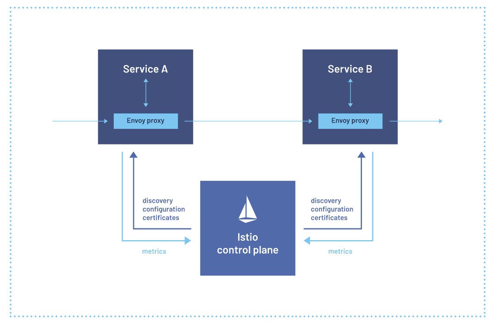

# Service Mesh com Istio

# Sumário
1. [O que é Service Mesh?](#o-que-é-service-mesh)
2. [O que é Istio?](#o-que-é-istio)
3. [Instalação do Istio](#instalação-do-istio)
4. [K3D](#k3d)
5. [Comandos do K3D](#comandos-do-k3d)

# O que é Service Mesh?
**Service Mesh** é uma arquitetura de rede que visa resolver desafios complexos associados à comunicação entre os serviços em uma infraestrutura de microsserviços. Ele fornece uma camada de abstração sobre a comunicação entre os serviços, permitindo a descoberta dinâmica, a roteamento inteligente, a segurança e o monitoramento avançados.

Conceitos e componentes-chave de um **Service Mesh**:

**Proxy Sidecar**: Cada instância de serviço é acompanhada por um ***proxy sidecar***, como o ***Envoy Proxy***, que é injetado no mesmo `pod`. O *proxy sidecar* intercepta todo o tráfego de entrada e saída do serviço, fornecendo funcionalidades avançadas, como roteamento, balanceamento de carga, segurança e monitoramento.

**Balanceamento de carga**: A **Service Mesh** distribui uniformemente o tráfego entre as instâncias de um serviço, garantindo alta disponibilidade e desempenho.

**Descoberta de Serviços**: O **Service Mesh** oferece descoberta de serviços dinamicamente, permitindo que os serviços se encontrem e se comuniquem de forma eficiente, sem a necessidade de configuração estática, ou seja, sem precisar saber os endereços IP ou portas. Isso é geralmente realizado por meio de um registro de serviço, como o *Consul* ou o *Kubernetes Service Discovery*.

**Roteamento de Tráfego**: O **Service Mesh** permite o roteamento avançado de tráfego com base em regras configuráveis, direcionando as solicitações para o serviço correto. Isso inclui roteamento com base em características como cabeçalhos HTTP, metadados do serviço, políticas de segurança e condições de tráfego.

**Segurança**: A segurança é uma preocupação central em um ambiente de microsserviços distribuído. O **Service Mesh** oferece recursos avançados de segurança, como autenticação mútua, autorização baseada em políticas, criptografia de comunicação e gerenciamento de chaves.

**Monitoramento e Observabilidade**: Com o **Service Mesh**, você pode obter *insights* detalhados sobre o tráfego de rede e o comportamento dos serviços. Isso inclui métricas de desempenho, rastreamento de solicitações, registros e alertas para ajudar na solução de problemas e no diagnóstico de problemas de maneira rápida e eficaz, permitindo que os desenvolvedores e operadores acompanhem o desempenho e a saúde dos serviços em tempo real.

**Resiliência**: O **Service Mesh** oferece recursos para aumentar a resiliência de aplicativos distribuídos, como ***retries***, ***circuit breakers***, ***rate limiting*** e ***failover*** automático.

Em resumo, o **Service Mesh** é uma abordagem poderosa para simplificar e fortalecer a comunicação entre os serviços em uma arquitetura de microsserviços. Ele fornece uma série de recursos essenciais, desde a descoberta de serviços até a segurança e o monitoramento avançados, ajudando as organizações a construir e operar aplicativos escaláveis e altamente disponíveis em ambientes de microsserviços complexos.

[Voltar para o sumário](#sumário)

# O que é Istio?
O Istio é uma plataforma de [***service mesh***](#o-que-é-service-mesh) de código aberto que fornece uma camada de abstração inteligente para gerenciar e conectar microsserviços em ambientes distribuídos. Ele foi projetado para resolver os desafios complexos associados à comunicação entre microsserviços distribuídos em uma arquitetura de contêineres.

A conectividade segura e resiliente é garantida através do balanceamento de carga inteligente, que distribui o tráfego entre as instâncias de forma eficiente e automatizada, assegurando alta disponibilidade e desempenho. A segurança integrada implementa autenticação, autorização e criptografia de tráfego para proteger seus microsserviços contra acessos não autorizados e ataques cibernéticos. Além disso, o monitoramento detalhado oferece visibilidade profunda do tráfego de rede, métricas de desempenho e logs, permitindo identificar e resolver problemas rapidamente.

A observação e controle granulares são possíveis através do gerenciamento de tráfego granular, que permite definir políticas de roteamento avançadas, controlar o fluxo de dados e implementar medidas de segurança personalizadas por microsserviço. O monitoramento em tempo real fornece dashboards e alertas para acompanhar o desempenho e a saúde dos microsserviços, permitindo identificar e solucionar problemas proativamente. O rastreamento de solicitações permite acompanhar o fluxo de solicitações entre os microsserviços, facilitando a depuração e a otimização do desempenho.

A integração com ferramentas existentes é facilitada pelo suporte a diversas plataformas, incluindo **Kubernetes**, **OpenShift** e **AWS Elastic Kubernetes Service (EKS)**. A integração com ferramentas de DevOps, como **Prometheus**, **Grafana** e **Jaeger**, facilita a adoção e o gerenciamento em workflows existentes. A extensibilidade permite a criação de plugins e extensões personalizados para atender às necessidades específicas da sua organização.

Os benefícios do **Istio** incluem a simplificação da gestão de microsserviços, reduzindo a complexidade da operação e do gerenciamento de microsserviços em ambientes distribuídos. A melhoria da segurança e confiabilidade garante a segurança robusta dos microsserviços e a confiabilidade das aplicações. A visibilidade e observação aprimoradas oferecem _insights_ profundos sobre o comportamento dos microsserviços, facilitando a identificação e resolução de problemas. O aumento da agilidade e da escalabilidade permite o desenvolvimento e a implantação de aplicações escaláveis e resilientes de forma mais rápida e eficiente.

Em resumo, o **Istio** oferece uma solução abrangente para os desafios de gerenciamento de microsserviços em ambientes de nuvem modernos. Ele fornece uma maneira eficaz de lidar com a complexidade associada à comunicação entre serviços distribuídos, oferecendo controle, segurança e observabilidade em toda a malha de serviços. Como uma plataforma de código aberto, o **Istio** continua a evoluir e inovar, fornecendo uma base sólida para a construção e operação de sistemas distribuídos escaláveis e confiáveis.

[Voltar para o sumário](#sumário)

# Arquitetura do **Istio**
A arquitetura do **Istio** é composta por vários componentes que trabalham juntos para fornecer funcionalidades avançadas de gerenciamento, segurança e observabilidade para microsserviços distribuídos. Os principais componentes da arquitetura do **Istio** são:

1. **Envoy Proxy**: O `Envoy` é o componente central da arquitetura do **Istio**. <u>Ele é um proxy de serviço de alto desempenho</u> e extensível que é <u>implantado ao lado de cada microsserviço (`pod`) para gerenciar o tráfego de rede</u>. O `Envoy` lida com tarefas como roteamento de tráfego, balanceamento de carga, descoberta de serviços, autenticação e autorização.

2. **Data Plane e Control Plane**: O **Istio** segue uma arquitetura de duas camadas, composta pelo `Data Plane` e pelo `Control Plane`. O `Data Plane` é composto por _proxies_ `Envoy` implantados ao lado de cada serviço, que gerenciam o tráfego de rede em tempo real, ou seja, <u>é um conjunto de `Envoy Proxy`</u>. O `Control Plane` é <u>responsável por configurar e controlar o comportamento do `Data Plane`</u>. Ele inclui componentes como o **Istio Pilot**, **Istio Mixer** e **Istio Citadel**.

3. **Pilot**: O **Istio Pilot** é <u>responsável por gerenciar as configurações de roteamento de tráfego e descoberta de serviços</u>. Ele converte as configurações de alto nível definidas pelos operadores em configurações específicas de _proxy_ que são distribuídas para os _proxies_ `Envoy` em tempo real.

4. **Mixer**: O **Istio Mixer** é <u>responsável pela coleta de telemetria, aplicação de políticas e autorização</u>. Ele fornece um ponto centralizado para aplicar políticas de segurança, monitorar o tráfego de rede e coletar métricas e registros de telemetria.

5. **Citadel**: O **Istio Citadel** é <u>responsável por gerenciar a identidade e a segurança dos microsserviços</u>. Ele emite certificados TLS e chaves de autenticação para os _proxies_ `Envoy` e fornece um mecanismo de autenticação mútua entre os serviços.

6. **Galley**: O **Istio Galley** é <u>responsável pela validação e distribuição de configurações de serviço</u>. Ele valida as configurações de alto nível definidas pelos operadores e as converte em configurações específicas de _proxy_ que são distribuídas para os _proxies_ `Envoy`.

7. **Telemetria e Ferramentas de Observabilidade**: O **Istio** integra-se a várias ferramentas de observabilidade, como ***Prometheus***, ***Grafana***, ***Jaeger*** e ***Zipkin***, para fornecer monitoramento e rastreamento distribuído do tráfego de rede entre os microsserviços.

No geral, a arquitetura do **Istio** é altamente distribuída e escalável, projetada para lidar com a complexidade associada à comunicação entre microsserviços em ambientes de nuvem modernos. Ao fornecer uma camada de abstração entre os microsserviços e a infraestrutura subjacente, o **Istio** simplifica o gerenciamento e a operação de sistemas distribuídos, oferecendo controle, segurança e observabilidade em toda a malha de serviços.



**Fontes:**
- [Istio](https://istio.io/latest/about/service-mesh/)

[Voltar para o sumário](#sumário)

## Instalação do Istio
### Passo-a-passo de Instalação do Istio
O Istio é uma malha de serviço (service mesh) para Kubernetes que ajuda a gerenciar a comunicação entre microserviços. Ele oferece observabilidade, segurança e controle de tráfego para aplicações em um cluster Kubernetes.

A seguir, estão as etapas básicas para instalar o Istio:

---

### Passo 1: Pré-requisitos
Antes de instalar o Istio, você precisa ter:

1. **Cluster Kubernetes** em execução. Você pode usar plataformas de Kubernetes locais como **Minikube**, **k3d** ou serviços em nuvem como **Google Kubernetes Engine (GKE)**, **Amazon EKS**, etc.
   
2. **kubectl**: A ferramenta de linha de comando do Kubernetes.

3. **Helm** (opcional): Para gerenciar a instalação do Istio via Helm charts.

---

### Passo 2: Baixar o Istio
1. Faça o download da versão mais recente do Istio:

```bash
curl -L https://istio.io/downloadIstio | sh -
```

2. Acesse o diretório da versão do Istio que foi baixada:

```bash
cd istio-<versão>
```

3. Adicione o binário do Istio ao seu caminho para poder usar o comando `istioctl`:

```bash
export PATH=$PWD/bin:$PATH
```

---

### Passo 3: Instalação do Istio no Kubernetes
O Istio pode ser instalado usando o **istioctl** (CLI oficial do Istio) ou usando o **Helm**.

#### Método 1: Instalação usando o `istioctl`
1. Instale o Istio com a configuração padrão:

```bash
istioctl install --set profile=demo -y
```

> **Nota**: O perfil `demo` é recomendado para desenvolvimento e testes, pois habilita todos os recursos do Istio. Para produção, você pode usar o perfil `default` ou configurar um personalizado.

2. Verifique se o Istio foi instalado corretamente:

```bash
kubectl get pods -n istio-system
```

Os pods que devem aparecer são:
- `istiod` (control plane do Istio)
- Pods para o **Istio IngressGateway** e **EgressGateway**

#### Método 2: Instalação usando Helm (alternativo)
1. Adicione o repositório do Istio Helm:

```bash
helm repo add istio https://istio-release.storage.googleapis.com/charts
```

2. Instale o Istio com Helm:

```bash
helm install istio-base istio/base -n istio-system --create-namespace
helm install istiod istio/istiod -n istio-system
```

3. (Opcional) Instale o **Istio IngressGateway**:

```bash
helm install istio-ingress istio/gateway -n istio-system
```

---

### Passo 4: Habilitar Sidecar Injection
Para que o Istio funcione com seus serviços, os proxies de sidecar precisam ser injetados nos pods. Isso pode ser feito automaticamente ao rotular namespaces.

1. Habilite a injeção de sidecar automática no namespace onde os serviços estão executando:

```bash
kubectl label namespace <seu-namespace> istio-injection=enabled
```

2. Reinicie os pods do seu namespace ou crie novos pods para garantir que o proxy sidecar seja injetado.

---

### Passo 5: Verificar a Instalação
Para garantir que o Istio está funcionando corretamente, você pode testar o tráfego de entrada.

1. Implante um aplicativo de exemplo (como o **Bookinfo**, que é fornecido com o Istio):

```bash
kubectl apply -f samples/bookinfo/platform/kube/bookinfo.yaml
```

2. Verifique os serviços e gateways expostos:

```bash
kubectl get svc -n istio-system
kubectl get gateway
```

3. Teste o tráfego de entrada acessando o serviço pelo endereço de IP do Ingress Gateway.

---

### Passo 6: Configurar Regras de Tráfego e Observabilidade
Após a instalação do Istio, você pode:

1. **Criar regras de roteamento** para seus serviços, por exemplo, balanceamento de carga, failover, ou circuit breaking.

2. **Habilitar observabilidade** utilizando o Grafana, Prometheus e Kiali, que podem ser ativados no perfil de instalação do Istio ou adicionados posteriormente.

---

### Comandos úteis pós-instalação
- **Desinstalar o Istio**:

```bash
istioctl x uninstall --purge
```

- **Ver a configuração ativa**:

```bash
istioctl proxy-status
```

---

Seguindo esses passos, você terá o Istio instalado e funcionando em seu cluster Kubernetes, pronto para gerenciar a comunicação entre os microserviços!

[Voltar para o sumário](#sumário)


# K3D
## O que é K3d?
K3d é uma ferramenta de código aberto usada para criar e gerenciar clusters Kubernetes de forma leve e eficiente. Ele simplifica o uso do Kubernetes ao permitir que você crie rapidamente clusters em ambientes de desenvolvimento locais. K3d é essencialmente um wrapper para o **K3s**, uma distribuição compacta do Kubernetes desenvolvida pela Rancher, projetada para ser mais rápida e usar menos recursos do que o Kubernetes completo. O K3d facilita a criação de clusters K3s dentro de contêineres Docker, tornando o processo rápido e adequado para testes, experimentação, e desenvolvimento.

A principal vantagem do K3d é que ele permite rodar um ambiente Kubernetes completo em um único nó ou em múltiplos nós com consumo de recursos muito menor, o que é ideal para desenvolvedores que querem testar aplicações e experimentar configurações Kubernetes sem a necessidade de infraestrutura pesada.

### Principais características do K3d:
- **Rápido**: Cria clusters de forma rápida, em questão de segundos.
- **Leve**: Utiliza menos recursos que uma instalação completa do Kubernetes.
- **Portabilidade**: Você pode rodar um cluster Kubernetes em praticamente qualquer máquina que suporte Docker.
- **Simplicidade**: Automatiza a criação e gerenciamento de clusters K3s, abstraindo a complexidade do Kubernetes tradicional.
- **Facilidade de uso:** Instalação e configuração simples, ideal para iniciantes e desenvolvedores.
- **Rapidez:** Criação rápida de clusters Kubernetes em ambientes locais.
- **Flexibilidade:** Permite criar clusters de um único nó ou multi-nó, com diferentes configurações.
- **Portabilidade:** Os clusters criados com o k3d são isolados em contêineres Docker, facilitando a migração entre diferentes ambientes.
- **Integração com Docker:** Aproveita as funcionalidades do Docker, como volumes, redes e compost.

## Vantagens do K3d
1. **Desenvolvimento Local**: O K3d é perfeito para ambientes de desenvolvimento local, onde você deseja testar configurações Kubernetes sem a necessidade de um cluster remoto.
2. **Ambiente Leve**: Ele é muito mais leve do que uma instalação Kubernetes convencional, o que o torna ideal para máquinas com menos recursos.
3. **Integração com Docker**: Ele se integra diretamente ao Docker, permitindo criar clusters Kubernetes dentro de contêineres Docker, o que facilita sua adoção por desenvolvedores já familiarizados com Docker.
4. **Multi-nó**: Embora seja leve, você ainda pode criar clusters multi-nós para testar configurações mais avançadas de Kubernetes.
5. **Configuração Rápida**: Com poucos comandos, você consegue criar e destruir clusters de Kubernetes, permitindo que você foque em desenvolver sua aplicação e não na configuração da infraestrutura.

## Comandos do K3d
A seguir está uma tabela com alguns dos comandos mais utilizados no K3d, junto com suas descrições e exemplos práticos de uso.

| Comando | Descrição | Exemplo de uso |
| --- | --- | --- |
| `k3d cluster create <nome>` | Cria um novo cluster Kubernetes. | `k3d cluster create my-cluster` |
| `k3d cluster create <nome> -p <port> --agents <agents-numbers>`  | Cria um novo cluster Kubernetes com o nome definido e realiza um *bind* com a porta do host e a porta do cluster e, defini o número de agentes (número de nodes) | `k3d cluster create my-cluster -p "8000:30000@loadbalancer" --agents 2`  |
| `k3d cluster create <nome> --servers <n> --agents <n> --api-port <port> --port <local>:<remote>@<loadbalancer>` | Cria um novo cluster Kubernetes, onde você pode especificar o número de servidores (control planes), agentes (nós), e portas expostas. | `k3d cluster create my-cluster --servers 1 --agents 2 --api-port 6550 --port 8080:80@loadbalancer` |
| `k3d cluster delete <nome>` | Remove um cluster Kubernetes existente. | `k3d cluster delete my-cluster` |
| `k3d cluster list` | Lista todos os clusters K3d criados. | `k3d cluster list` |
| `k3d cluster start <nome>` | Inicia um cluster Kubernetes parado. | `k3d cluster start my-cluster` |
| `k3d cluster stop <nome>`  | Para um cluster Kubernetes em execução. | `k3d cluster stop my-cluster` |
| `k3d node create <nome> --cluster <cluster-name>` | Adiciona um novo nó a um cluster Kubernetes existente. | `k3d node create my-node --cluster my-cluster` |
| `k3d node delete <nome>`  | Remove um nó de um cluster Kubernetes. | `k3d node delete my-node` |
| `k3d node start <nome>` | Inicia um nó Kubernetes que foi parado. | `k3d node start my-node` |
| `k3d node stop <nome>` | Para um nó Kubernetes em execução. | `k3d node stop my-node` |
| `k3d node edit <nome> --role <role>`  | Edita as configurações de um nó (por exemplo, atribui ou altera o papel de servidor ou agente). | `k3d node edit my-node --role server` |
| `k3d kubeconfig merge --all` | Mescla os kubeconfigs de todos os clusters criados pelo K3d. | `k3d kubeconfig merge --all` |
| `k3d registry create <nome>`  | Cria um registro local de imagens Docker. | `k3d registry create my-registry` |
| `k3d registry create <nome> --port <port>` | Cria um registro de contêiner local, com uma porta especificada. | `k3d registry create my-registry --port 5000` |
| `k3d registry list` | Lista todos os registros Docker locais criados pelo K3d. | `k3d registry list` |
| `k3d registry delete <nome>`  | Remove um registro de contêiner local. | `k3d registry delete my-registry` |
| `k3d registry add <nome> --cluster <cluster-name>` | Adiciona um registro local a um cluster existente. | `k3d registry add my-registry --cluster my-cluster` |
| `k3d cluster start <nome>` | Inicia um cluster Kubernetes parado. | `k3d cluster start my-cluster` |
| `k3d cluster stop <nome>` | Para um cluster Kubernetes em execução. | `k3d cluster stop my-cluster` |
| `k3d kubeconfig get <nome>` | Exibe a configuração kubeconfig para o cluster. | `k3d kubeconfig get my-cluster` |
| `k3d load image <imagem> --cluster <nome>` | Carrega uma imagem Docker no cluster. | `k3d load image my-image:latest --cluster my-cluster` |
| `k3d version` | Mostra a versão instalada do K3d. | `k3d version` |
| `k3d help` | Mostra a ajuda para todos os comandos disponíveis no K3d. | `k3d help` |

[Voltar para o sumário](#sumário)

### Flags com Descrições:
- **`-servers <n>`**: Define o número de nós de servidor (control planes) que serão criados no cluster.
- **`-agents <n>`**: Define o número de nós de agente (trabalhadores) no cluster.
- **`-api-port <port>`**: Define uma porta específica para o servidor de API do Kubernetes, usada para comunicação com o cluster.
- **`-port <local>:<remote>@<loadbalancer>`**: Mapeia uma porta do seu host local para o cluster Kubernetes, útil para expor serviços.
- **`-role <role>`**: Define o papel de um nó (servidor ou agente).
- **`-cluster <cluster-name>`**: Especifica a qual cluster um nó ou registro de contêiner pertence.
- **`-port <port>`**: Define a porta onde o registro de contêiner local estará disponível.
- **`-all`**: Utilizado no contexto de kubeconfig para aplicar uma ação a todos os clusters criados.


## Exemplo de uso: Criando um cluster com K3d
A seguir está um exemplo prático de como você pode criar e gerenciar um cluster K3d.

1. **Criar um cluster Kubernetes com K3d**:
    
    ```bash
    k3d cluster create dev-cluster
    ```
    
    Esse comando criará um cluster com o nome "dev-cluster" em poucos segundos.
    
2. **Listar clusters existentes**:
    
    ```bash
    k3d cluster list
    ```
    
    Exibe todos os clusters criados com K3d.
    
3. **Parar o cluster**:
    
    ```bash
    k3d cluster stop dev-cluster
    ```
    
    Esse comando para o cluster especificado.
    
4. **Excluir o cluster**:
    
    ```bash
    k3d cluster delete dev-cluster
    ```
    
    Remove o cluster "dev-cluster" da sua máquina.
    
5. **Carregar uma imagem Docker no cluster**:
    
    ```bash
    k3d load image my-app:latest --cluster dev-cluster
    ```
    
    Carrega uma imagem Docker no cluster Kubernetes, tornando-a disponível para uso no cluster.
    

**Fluxograma básico de uso:**
1. **Instalação:** Siga as instruções de instalação do k3d para o seu sistema operacional.
2. **Criação do cluster:** Use o comando `k3d cluster create` para criar um novo cluster.
3. **Configuração do kubeconfig:** Utilize o comando `k3d kubeconfig get` para obter o arquivo de configuração e o comando `kubectl` para interagir com o cluster.
4. **Deploy de aplicações:** Utilize o comando `kubectl` para implantar suas aplicações no cluster Kubernetes.
5. **Gerenciamento do cluster:** Utilize os comandos do k3d para gerenciar o ciclo de vida do cluster, como iniciar, parar, deletar e escalar.

## Conclusão
K3d é uma ferramenta poderosa para desenvolvedores que buscam um ambiente Kubernetes eficiente e leve, especialmente em ambientes de desenvolvimento local. Com comandos simples, ele facilita o processo de criação, gerenciamento e remoção de clusters K3s dentro de contêineres Docker.

### **Para mais informações:**
- **Documentação oficial:** https://k3d.io/
- **Repositório no GitHub:** https://github.com/k3d-io/k3d

[Voltar para o sumário](#sumário)
